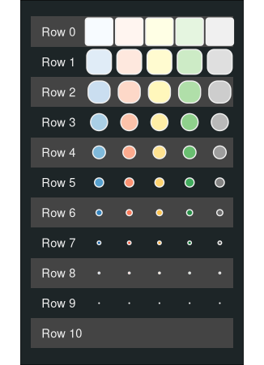
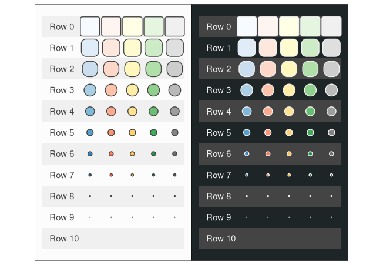
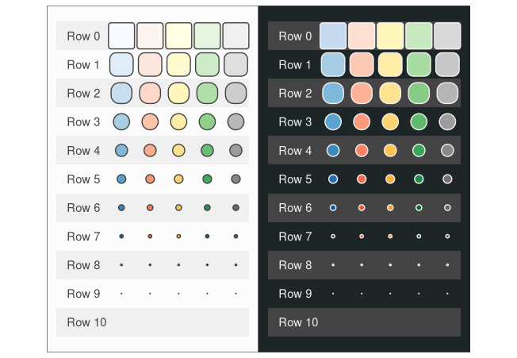

# Explore palettes

``` r
library(tidyverse)
library(ggplot2)

smear <- function(cols) {
  grDevices::colorRampPalette(cols)(101)
}

knitr::opts_chunk$set(
  fig.width = 3.4,
  fig.height = 4.7
)
```

Create objects

``` r
light_palettes <- list(
  "Blues" = RColorBrewer::brewer.pal(9, "Blues") %>% c("#011636") %>% rev %>% smear,
  "Reds" = RColorBrewer::brewer.pal(9, "Reds")[-8:-9] %>% rev %>% smear,
  "YlOrBr" = RColorBrewer::brewer.pal(9, "YlOrBr")[-7:-9] %>% rev %>% smear,
  "Greens" = RColorBrewer::brewer.pal(9, "Greens")[-1] %>% c("#00250f") %>% rev %>% smear,
  "Greys" = RColorBrewer::brewer.pal(9, "Greys")[-1] %>% rev %>% smear
)
light_background <- "#fcfcfc"
light_alt <- "#f0f0f0"

dark_palettes <- list(
  "Blues" = RColorBrewer::brewer.pal(9, "Blues") %>% c("#011636") %>% rev %>% smear,
  "Reds" = RColorBrewer::brewer.pal(9, "Reds")[-8:-9] %>% rev %>% smear,
  "YlOrBr" = RColorBrewer::brewer.pal(9, "YlOrBr")[-7:-9] %>% rev %>% smear,
  "Greens" = RColorBrewer::brewer.pal(9, "Greens")[-1] %>% c("#00250f") %>% rev %>% smear,
  "Greys" = RColorBrewer::brewer.pal(9, "Greys")[-1] %>% rev %>% smear
)
dark_background <- "#1d2527"
dark_alt <- "#444444"
```

Construct data for plot

``` r
df <- crossing(
  tibble(
    x = seq_along(light_palettes) * 1.1,
    palette = names(light_palettes)
  ),
  tibble(
    y = seq(0, 11, by = 1.1),
    value = seq(0, 1, by = .1)
  )
)

# compute size and corners
df2 <- df %>%
  transmute(
    xmin = x - value / 2,
    xmax = x + value / 2,
    ymin = y - value / 2,
    ymax = y + value / 2,
    value,
    palette
  ) %>%
  rowwise() %>%
  pmap_df(function(xmin, xmax, ymin, ymax, value, palette) {
    funkyheatmap:::score_to_funky_rectangle(xmin, xmax, ymin, ymax, value) %>% mutate(palette)
  })
```

Construct background rects

``` r
row_rects <- tibble(
  xmin = min(df2$xmin) - 2,
  xmax = max(df2$xmax),
  y = seq(0, 11, by = 2.2),
  ymin = y - .55,
  ymax = y + .55
)
row_text <- tibble(
  x = -1,
  y = unique(df$y),
  label = paste0("Row ", seq(10, 0))
)
```

Make light plot

``` r
# compute colours
df3 <- df2 %>%
  group_by(palette) %>%
  mutate(
    col_ix = round(value * (length(light_palettes[[palette[[1]]]]) - 1)) + 1,
    col_val = light_palettes[[palette[[1]]]][col_ix]
  )

gl <-
  ggplot(df3) +
  geom_rect(aes(xmin = xmin, xmax = xmax, ymin = ymin, ymax = ymax, fill = light_alt), row_rects) +
  geom_text(aes(x = x, y = y, label = label), row_text, hjust = 0, color = dark_alt) +
  funkyheatmap::geom_rounded_rect(
    aes(xmin = xmin, xmax = xmax, ymin = ymin, ymax = ymax, radius = corner_size, fill = col_val),
    size = .5, colour = dark_alt
  ) +
  coord_equal() +
  cowplot::theme_nothing() +
  scale_fill_identity() +
  theme(plot.background = element_rect(fill = light_background))
gl
```


Dark plot with light palettes

``` r
# compute colours
df3 <- df2 %>%
  group_by(palette) %>%
  mutate(
    col_ix = round(value * (length(light_palettes[[palette[[1]]]]) - 1)) + 1,
    col_val = light_palettes[[palette[[1]]]][col_ix]
  )

gd <- 
  ggplot(df3) +
  geom_rect(aes(xmin = xmin, xmax = xmax, ymin = ymin, ymax = ymax, fill = dark_alt), row_rects) +
  geom_text(aes(x = x, y = y, label = label), row_text, hjust = 0, color = light_alt) +
  funkyheatmap::geom_rounded_rect(
    aes(xmin = xmin, xmax = xmax, ymin = ymin, ymax = ymax, radius = corner_size, fill = col_val),
    size = .5, colour = light_alt
  ) +
  coord_equal() +
  cowplot::theme_nothing() +
  scale_fill_identity() +
  theme(plot.background = element_rect(fill = dark_background))
gd
```



## Try to improve

``` r
# compute colours
df3 <- df2 %>%
  group_by(palette) %>%
  mutate(
    col_ix = round(value * (length(light_palettes[[palette[[1]]]]) - 1)) + 1,
    col_val = light_palettes[[palette[[1]]]][col_ix]
  )

gl2 <- 
  ggplot(df3) +
  geom_rect(aes(xmin = xmin, xmax = xmax, ymin = ymin, ymax = ymax, fill = light_alt), row_rects) +
  geom_text(aes(x = x, y = y, label = label), row_text, hjust = 0, color = dark_alt) +
  funkyheatmap::geom_rounded_rect(
    aes(xmin = xmin, xmax = xmax, ymin = ymin, ymax = ymax, radius = corner_size, fill = col_val),
    size = .5, colour = dark_alt
  ) +
  coord_equal() +
  cowplot::theme_nothing() +
  scale_fill_identity() +
  theme(plot.background = element_rect(fill = light_background))
gl2
```


Make dark plot with better palettes

``` r
dark_palettes <- list(
  "Blues" = RColorBrewer::brewer.pal(9, "Blues")[-1:-2] %>% c("#011636", "black") %>% rev %>% smear,
  "Reds" = RColorBrewer::brewer.pal(9, "Reds")[c(-1, -9)] %>% rev %>% smear,
  "YlOrBr" = RColorBrewer::brewer.pal(9, "YlOrBr")[c(-1, -8, -9)] %>% rev %>% smear,
  "Greens" = RColorBrewer::brewer.pal(9, "Greens")[-1:-2] %>% c("#00250f", "black") %>% rev %>% smear,
  "Greys" = RColorBrewer::brewer.pal(9, "Greys")[-1:-2] %>% rev %>% smear
)

# compute colours
df3 <- df2 %>%
  group_by(palette) %>%
  mutate(
    col_ix = round(value * (length(dark_palettes[[palette[[1]]]]) - 1)) + 1,
    col_val = dark_palettes[[palette[[1]]]][col_ix]
  )

gd2 <-
  ggplot(df3) +
  geom_rect(aes(xmin = xmin, xmax = xmax, ymin = ymin, ymax = ymax, fill = dark_alt), row_rects) +
  geom_text(aes(x = x, y = y, label = label), row_text, hjust = 0, color = light_alt) +
  funkyheatmap::geom_rounded_rect(
    aes(xmin = xmin, xmax = xmax, ymin = ymin, ymax = ymax, radius = corner_size, fill = col_val),
    size = .5, colour = light_alt
  ) +
  coord_equal() +
  cowplot::theme_nothing() +
  scale_fill_identity() +
  theme(plot.background = element_rect(fill = dark_background))
gd2
```


## Conclusion

``` r
knitr::opts_chunk$set(
  fig.width = 3.4 * 2,
  fig.height = 4.7
)
```

Before

``` r
patchwork::wrap_plots(gl, gd, nrow = 1)
```



New

``` r
patchwork::wrap_plots(gl2, gd2, nrow = 1)
```


